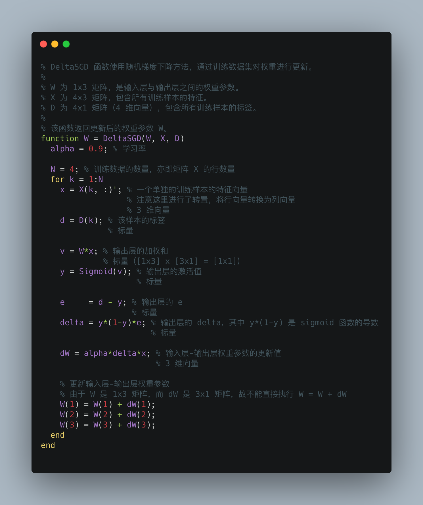

# 《MATLAB Deep Learning》源代码

本仓库是书籍《MATLAB Deep Learning》（Phil Kim 攥写）的示例源代码，克隆至 [Apress/matlab-deep-learning](https://github.com/Apress/matlab-deep-learning)。

查看原始 README 请[点击](./README_EN.md)。

## 说明

原仓库提供了 Matlab 与 Python 支持，我加入了相应的 Go 与 R 语言示例，对代码进行了格式化，同时加入了相应的**中文**注释与**中文**说明文档，其中：

* Matlab 代码在 [`Deep-Learning-for-Beginners-master/Matlab/`](./Deep-Learning-for-Beginners-master/Matlab/) 目录下，包含有**中文**注释和**中文**说明文档（在每一章节目录下）
* Python 代码在 [`Deep-Learning-for-Beginners-master/Python/`](./Deep-Learning-for-Beginners-master/Python/) 目录下
* Go 代码在 [`Deep-Learning-for-Beginners-master/Go/`](./Deep-Learning-for-Beginners-master/Go/) 目录下
* R 代码在 [`Deep-Learning-for-Beginners-master/R/`](./Deep-Learning-for-Beginners-master/R/) 目录下

## 分支

* [`golang-support`](https://github.com/azxj/matlab-deep-learning/tree/golang-support) 分支仅包含新增的 Go 语言支持内容。
* [`r-support`](https://github.com/azxj/matlab-deep-learning/tree/r-support) 分支仅包含新增的 R 语言支持内容。
* [`golang-r-support`](https://github.com/azxj/matlab-deep-learning/tree/golang-r-support) 分支合并了 `golang-support` 分支与 `r-support` 分支的内容。
* [`master`](https://github.com/azxj/matlab-deep-learning/tree/master) 分支合并了 `golang-r-support` 分支的内容，对原仓库中 Matlab 与 Python 的代码进行了格式化，同时在 Matlab 代码中加入了相应的**中文**注释和**中文**说明文档。

## 关于中文注释

我为《Matlab Deep Learning》中出现的 Matlab 代码添加了中文注释，样式如下：

```matlab
% DeltaSGD 函数使用随机梯度下降方法，通过训练数据集对权重进行更新。
%
% W 为 1x3 矩阵，是输入层与输出层之间的权重参数。
% X 为 4x3 矩阵，包含所有训练样本的特征。
% D 为 4x1 矩阵（4 维向量），包含所有训练样本的标签。
%
% 该函数返回更新后的权重参数 W。
function W = DeltaSGD(W, X, D)
  alpha = 0.9; % 学习率

  N = 4; % 训练数据的数量，亦即矩阵 X 的行数量
  for k = 1:N
    x = X(k, :)'; % 一个单独的训练样本的特征向量
                  % 注意这里进行了转置，将行向量转换为列向量
                  % 3 维向量
    d = D(k); % 该样本的标签
              % 标量

    v = W*x; % 输出层的加权和
             % 标量（[1x3] x [3x1] = [1x1]）
    y = Sigmoid(v); % 输出层的激活值
                    % 标量

    e     = d - y; % 输出层的 e
                   % 标量
    delta = y*(1-y)*e; % 输出层的 delta，其中 y*(1-y) 是 sigmoid 函数的导数
                       % 标量

    dW = alpha*delta*x; % 输入层-输出层权重参数的更新值
                        % 3 维向量

    % 更新输入层-输出层权重参数
    % 由于 W 是 1x3 矩阵，而 dW 是 3x1 矩阵，故不能直接执行 W = W + dW
    W(1) = W(1) + dW(1);
    W(2) = W(2) + dW(2);
    W(3) = W(3) + dW(3);
  end
end
```



希望可以帮助你更好地理解书中的代码。

## 发布

[v1.0](https://github.com/azxj/matlab-deep-learning/releases/tag/v1.0) 版为书籍原版源代码，未经任何修正或更新。

## 贡献

详见 [contributing.md](./contributing.md)。
